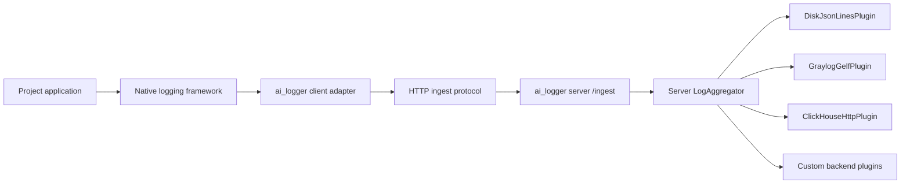

# Logging Architecture

Last reviewed: 2026-07-06

## Goal

Provide a universal client/server logging system for `ai_logger` that can be
connected to projects on different stacks through native client adapters and
run separately as a local server process.

Success criteria:

- application code logs through a stable abstraction;
- project clients can be Python handlers, NLog targets, log4net appenders,
  Serilog sinks, pino transports, or other native logging adapters;
- every adapter sends normalized records to the ai_logger ingest server;
- the server can route accepted records to selected backend systems;
- an aggregator receives, enriches, filters, and fan-outs records;
- logging destinations are replaceable plugins;
- disk, HTTP, Graylog GELF, and ClickHouse-oriented plugins are available;
- exception logging can be applied with a context manager or decorator;
- plugin failures do not crash the application path by default.

## Layers

## Contracts

`Logger` is the public application API. It creates structured `LogRecord`
instances from severity, message, context, tags, and optional exception data.

`LogAggregator` is the delivery coordinator. It adds default context, applies a
minimum severity filter and custom filters, then emits each record to registered
plugins.

Client adapters are stack-specific bridges. A Python project may use
`AiLoggerHttpHandler`; .NET can use an ASP.NET Core `ILoggerProvider`, NLog
target, log4net appender, or Serilog sink; Node.js can use a pino or winston
transport. All adapters send the same normalized ingest protocol.

`AiLoggerClient` is the framework-neutral client core used by native adapters.
It owns ingest delivery, bearer-token authorization, default context enrichment,
common secret-field redaction, optional JSON Lines fallback, and delivery
failure tracking. Native adapters should convert framework events into
`LogRecord` or protocol dictionaries and delegate delivery to this client core
instead of duplicating HTTP behavior.

Project agents install adapters through the documented adapter manifest and
install guide. `docs/adapter-manifest.json` is the machine-readable adapter
selection contract, and `docs/agent-install.md` is the human-readable
installation workflow. The first implemented verification entry point is
`ai-logger-client-check`, which sends `ai_logger.client_check` to the configured
server and returns a non-zero exit code when delivery fails.

Project agents deploy the server through the documented server deploy manifest
and deploy guide. `docs/server-deploy-manifest.json` is the machine-readable
server deployment contract, and `docs/server-deploy.md` is the human-readable
machine deployment workflow. The server verification entry point is
`ai-logger-server-check`, which checks `/health` and returns a non-zero exit
code when the server is unavailable or unhealthy.

Graylog GELF HTTP is the first centralized server backend implementation.
`GraylogGelfPlugin` converts accepted `LogRecord` instances to GELF 1.1 and
sends them to `AI_LOGGER_GRAYLOG_GELF_URL`. `ai-logger-graylog-check` sends a
direct `ai_logger.graylog_check` GELF event so an agent can verify the Graylog
input before routing project traffic through the ai_logger server.

`LogIngestHttpServer` is the server-side entry point. It accepts JSON
`LogRecord` payloads at `/ingest`, optionally verifies a bearer token, restores
records, and emits them into the server aggregator. It also exposes `/health`
for machine deployment checks. `/health` reports plugin count and plugin names
so an agent can confirm that `graylog_gelf` is enabled.

`LogPlugin` implementations own delivery details. A plugin may write to disk,
send over the network, keep records in memory, or adapt records to another
logging backend.

Plugin delivery failures are captured in `LogAggregator.failed_records` and are
reported to the configured error stream. They are intentionally not re-raised
from the application logging path.

## Current Implementation Map

- Core API: `src/ai_logger/logger.py`
- Aggregation: `src/ai_logger/aggregator.py`
- Records and levels: `src/ai_logger/records.py`, `src/ai_logger/levels.py`
- Plugins: `src/ai_logger/plugins.py`
- Environment configuration: `src/ai_logger/config.py`
- Exception helpers: `src/ai_logger/context.py`
- Tool/component logger helper: `src/ai_logger/tool_logging.py`
- Client core: `src/ai_logger/client.py`
- Python logging adapter: `src/ai_logger/logging_adapter.py`
- Server ingest: `src/ai_logger/server.py`
- Client install check: `src/ai_logger/client_check.py`
- Server health check: `src/ai_logger/server_check.py`
- Graylog backend check: `src/ai_logger/graylog_check.py`
- Protocol documentation: `docs/ingest-protocol.md`
- Adapter documentation: `docs/client-adapters.md`
- Agent install documentation: `docs/agent-install.md`
- Adapter manifest: `docs/adapter-manifest.json`
- Server deploy documentation: `docs/server-deploy.md`
- Server deploy manifest: `docs/server-deploy-manifest.json`
- Verification: `tests/test_logging_core.py`,
  `tests/test_client_server.py`, `tests/test_client_adapters.py`,
  `tests/test_client_check.py`, `tests/test_server_check.py`,
  `tests/test_graylog_check.py`
