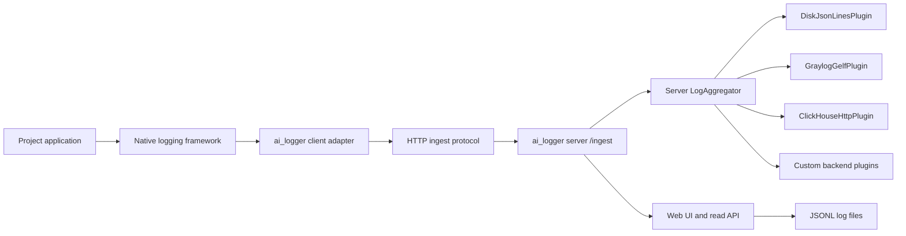

# Logging Architecture

Last reviewed: 2026-07-07

## Goal

Provide a universal client/server logging system for `ai_logger` that can be
connected to projects on different stacks through native client adapters and
run separately as a local server process.

Success criteria:

- application code logs through a stable abstraction;
- project clients can be Python handlers, NLog targets, log4net appenders,
  Serilog sinks, pino transports, or other native logging adapters;
- every adapter sends normalized records to the ai_logger ingest server;
- the server can route accepted records to selected backend systems;
- an aggregator receives, enriches, filters, and fan-outs records;
- logging destinations are replaceable plugins;
- disk, per-project daily JSONL, HTTP, Graylog GELF, and ClickHouse-oriented
  plugins are available;
- a local web UI can browse stored JSONL logs by project, file, and level;
- exception logging can be applied with a context manager or decorator;
- plugin failures do not crash the application path by default.

## Layers

## Contracts

`Logger` is the public application API. It creates structured `LogRecord`
instances from severity, message, context, tags, and optional exception data.

`LogAggregator` is the delivery coordinator. It adds default context, applies a
minimum severity filter and custom filters, then emits each record to registered
plugins.

Client adapters are stack-specific bridges. A Python project may use
`AiLoggerHttpHandler`; .NET can use an ASP.NET Core `ILoggerProvider`, NLog
target, log4net appender, or Serilog sink; Node.js can use a pino or winston
transport. All adapters send the same normalized ingest protocol.

`AiLoggerClient` is the framework-neutral client core used by native adapters.
It owns ingest delivery, bearer-token authorization, default context enrichment,
common secret-field redaction, optional JSON Lines fallback, and delivery
failure tracking. Native adapters should convert framework events into
`LogRecord` or protocol dictionaries and delegate delivery to this client core
instead of duplicating HTTP behavior.

Project agents install adapters through the documented adapter manifest and
install guide. `docs/adapter-manifest.json` is the machine-readable adapter
selection contract, and `docs/agent-install.md` is the human-readable
installation workflow. The first implemented verification entry point is
`ai-logger-client-check`, which sends `ai_logger.client_check` to the configured
server and returns a non-zero exit code when delivery fails.

Project agents deploy the server through the documented server deploy manifest
and deploy guide. `docs/server-deploy-manifest.json` is the machine-readable
server deployment contract, and `docs/server-deploy.md` is the human-readable
machine deployment workflow. The server verification entry point is
`ai-logger-server-check`, which checks `/health` and returns a non-zero exit
code when the server is unavailable or unhealthy.

Graylog GELF HTTP is the first centralized server backend implementation.
`GraylogGelfPlugin` converts accepted `LogRecord` instances to GELF 1.1 and
sends them to `AI_LOGGER_GRAYLOG_GELF_URL`. `ai-logger-graylog-check` sends a
direct `ai_logger.graylog_check` GELF event so an agent can verify the Graylog
input before routing project traffic through the ai_logger server.

When no external Graylog backend exists, agents can start the project-local
Docker Compose backend from `deploy/graylog/`. That stack runs Graylog Open,
MongoDB, and OpenSearch, exposes the UI/API at `http://127.0.0.1:9000/`, and
exposes the GELF HTTP input at `http://127.0.0.1:12201/gelf` after
`deploy/graylog/create-gelf-http-input.ps1` creates the input. Local Graylog
password material belongs in ignored `deploy/graylog/.env`, not in committed
docs or project memory.

`ProjectDailyJsonLinesPlugin` is the preferred local fallback when multiple
projects send logs to one ai_logger server. It writes records under
`<root>/<project>/YYYY-MM-DD.jsonl`, using the `context.project` value when
present and a sanitized logger-name fallback otherwise. `AI_LOGGER_SERVER_JSONL_PATH`
remains available for a single historical file, and both sinks may be enabled
together when duplicate local storage is intentional.

`ai-logger-log-query` is the first LLM inspection surface. It reads JSON Lines
records from one file or a directory of `*.jsonl` files. Its default path is
`AI_LOGGER_QUERY_LOGS_PATH`, `AI_LOGGER_SERVER_PROJECT_DAILY_DIR`,
`AI_LOGGER_SERVER_JSONL_PATH`, or `logs/server.jsonl`. It compacts recent
records and asks DeepSeek through the OpenAI-compatible `/chat/completions` API.
It must not print or store `DEEPSEEK_API_KEY`; missing keys are reported as a
configuration blocker. The CLI also supports `--print-context` for offline
verification without an LLM call.

The server web UI is the first browser inspection surface. `LogIngestHttpServer`
serves the UI at `/`, project/file/level metadata at `/api/overview`, recent
records at `/api/logs`, and natural-language search at `/api/search`. The UI
reads JSON Lines logs from `AI_LOGGER_WEB_LOGS_ROOT`, then falls back through
`AI_LOGGER_QUERY_LOGS_PATH`, `AI_LOGGER_SERVER_PROJECT_DAILY_DIR`,
`AI_LOGGER_SERVER_JSONL_PATH`, and `logs`. Project folders follow the
`ProjectDailyJsonLinesPlugin` layout: `<root>/<project>/YYYY-MM-DD.jsonl`.
The `/api/logs` read order is newest first, with later records from the same
timestamp displayed above earlier records.
When no DeepSeek key is configured, `/api/search` must keep working through
bounded local candidate ranking and return a warning instead of exposing or
requesting a secret in the browser.
The web search response is a two-part inspection result: `summary` is the bot
answer shown above the table, and `matches` are the supporting log rows shown
below it. When text ranking finds no local candidates but recent records exist
for the selected project/file/level scope, `/api/search` may send those recent
records to the configured LLM provider so questions such as "what broke in this
bot?" still receive an evidence-backed answer instead of stopping at an empty
local search result.

`LogIngestHttpServer` is the server-side entry point. It accepts JSON
`LogRecord` payloads at `/ingest`, optionally verifies a bearer token, restores
records, and emits them into the server aggregator. It also exposes `/health`
for machine deployment checks and the browser UI/read API. `/health` reports
plugin count and plugin names so an agent can confirm that `graylog_gelf` is
enabled.

`LogPlugin` implementations own delivery details. A plugin may write to disk,
send over the network, keep records in memory, or adapt records to another
logging backend.

Plugin delivery failures are captured in `LogAggregator.failed_records` and are
reported to the configured error stream. They are intentionally not re-raised
from the application logging path.

## Current Implementation Map

- Core API: `src/ai_logger/logger.py`
- Aggregation: `src/ai_logger/aggregator.py`
- Records and levels: `src/ai_logger/records.py`, `src/ai_logger/levels.py`
- Plugins: `src/ai_logger/plugins.py`
- Environment configuration: `src/ai_logger/config.py`
- Exception helpers: `src/ai_logger/context.py`
- Tool/component logger helper: `src/ai_logger/tool_logging.py`
- Client core: `src/ai_logger/client.py`
- Python logging adapter: `src/ai_logger/logging_adapter.py`
- Server ingest: `src/ai_logger/server.py`
- Server web UI and read repository: `src/ai_logger/web.py`
- Client install check: `src/ai_logger/client_check.py`
- Server health check: `src/ai_logger/server_check.py`
- Graylog backend check: `src/ai_logger/graylog_check.py`
- LLM provider boundary: `src/ai_logger/llm.py`,
  `src/ai_logger/log_search_providers.py`
- Smart log search: `src/ai_logger/log_search.py`,
  `src/ai_logger/log_search_cli.py`
- LLM log query: `src/ai_logger/log_query.py`
- Protocol documentation: `docs/ingest-protocol.md`
- LLM search documentation: `docs/llm-log-search.md`
- Adapter documentation: `docs/client-adapters.md`
- Agent install documentation: `docs/agent-install.md`
- Adapter manifest: `docs/adapter-manifest.json`
- Server deploy documentation: `docs/server-deploy.md`
- Server deploy manifest: `docs/server-deploy-manifest.json`
- Local Graylog deployment: `deploy/graylog/README.md`,
  `deploy/graylog/docker-compose.yml`
- Verification: `tests/test_logging_core.py`,
  `tests/test_client_server.py`, `tests/test_client_adapters.py`,
  `tests/test_client_check.py`, `tests/test_server_check.py`,
  `tests/test_graylog_check.py`, `tests/test_log_search.py`,
  `tests/test_log_query.py`

## LLM Log Search Contract

Smart log search is a read-side analysis layer over collected server-side logs.
It must not replace the ingest protocol or backend plugin model.

The first implementation reads JSON Lines logs from a configured local file,
keeps only a bounded recent window, ranks candidate records locally, then sends
only the bounded candidate set to an LLM provider. This keeps large log files
out of provider requests and gives deterministic fallback behavior when the LLM
is unavailable.

Codex app-server is the default provider, using model
`gpt-codex-spark-high` unless `AI_LOGGER_CODEX_MODEL` or `CODEX_MODEL`
overrides it. The search layer also supports the reusable `llm_providers`
provider naming contract: `codex`, `deepseek`, `openai-compatible`, `mock`,
`local`, and `none`. DeepSeek keys are read from `DEEPSEEK_API_KEY` or
`AI_LOGGER_DEEPSEEK_API_KEY`; generic OpenAI-compatible keys are read from
`AI_LOGGER_LLM_API_KEY` or `LLM_API_KEY`. Keys must not be persisted in source,
documentation examples, project memory, logs, or search output. Model, base
URL, timeout, thinking mode, token cap, candidate count, top-K, and JSONL path
are configuration values, not code constants.

Provider integration is behind `LogSearchLlmProvider`. Future providers should
implement the same query/candidate analysis contract and preserve the local
candidate-ranking fallback.

The web UI natural-language search box uses the same provider registry as the
CLI. Users can leave provider selection on automatic environment-driven routing
or choose `codex`, `deepseek`, `openai-compatible`, `mock`, or `local` for a single
`/api/search` request. Search responses include the actual provider, warnings,
selected records, scores, and LLM/local reasons so the answer remains
evidence-backed.

### Related Provider Logic Source

`D:\AI\llm_providers` is registered as a connected project and reusable logic
source for smart-search provider refactoring. Its portable contracts are mapped
in
`tools/project-memory/specs/integration-contracts/llm-providers-logic-map.md`.
The first adoption keeps `ai_logger`'s log-search domain contract, candidate
redaction, record-id validation, and local fallback behavior as the caller-owned
layer while moving generic provider selection, transport configuration, mock
behavior, and JSON output parsing behind `src/ai_logger/log_search_providers.py`
and the stdlib clients in `src/ai_logger/llm.py`.
